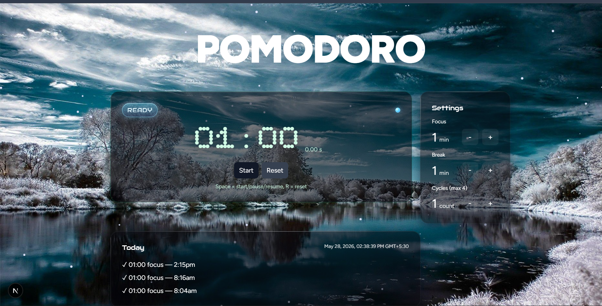

# Pomodoro Timer

Minimal Next.js Pomodoro timer with UI and history.

**Live:** [pomodoro-timer-hazel-iota.vercel.app](https://pomodoro-timer-hazel-iota.vercel.app/)
**Repo:** [github.com/kris07hna/pomodoro-timer](https://github.com/kris07hna/pomodoro-timer)

Quick start:

1. Install: `npm install`
2. Run: `npm run dev`
